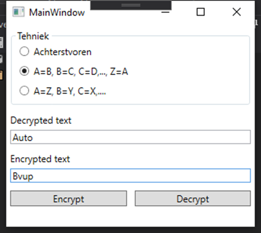
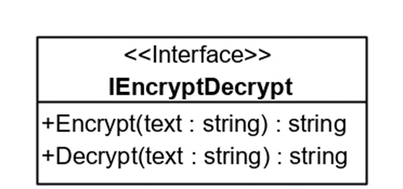
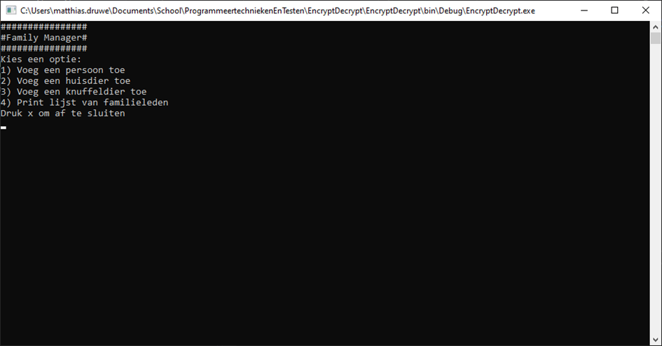
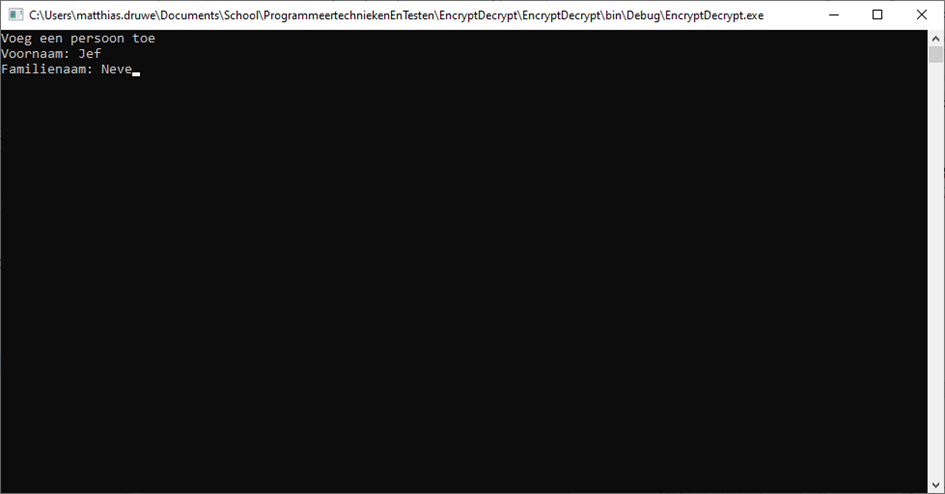
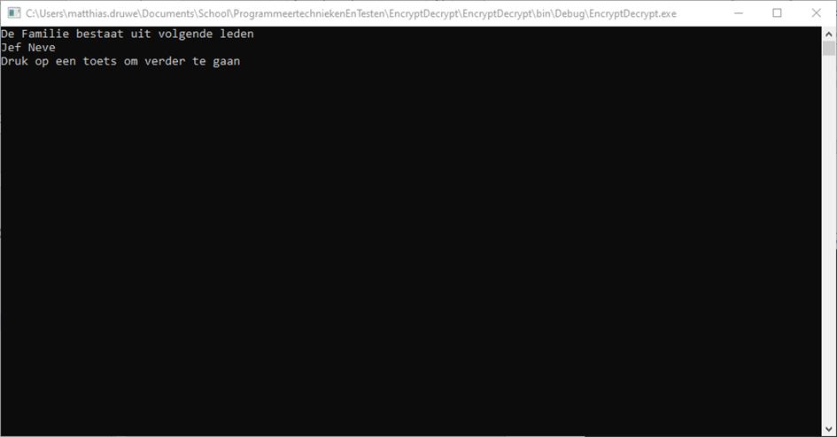

# Oefeningen Interfaces
## Aanmaken interfaces
Schrijf een interface voor onderstaande situaties:
* Voor een klasse die ervoor zorgt dat we kunnen lezen en schrijven naar een file
* Interface die ervoor zorgt dat er iets gebeurd wanneer er op een item geklikt wordt. De interface noem je IClickable.
* Voor een dataRepository die een User tabel aanspreekt. Voorzie alle CRUD operaties. Maak een interface voor de repository.

## Text encrypter

Schrijf een WPF applicatie die helpt om tekst te encrypteren en decrypteren. Zorg ervoor dat de gebruiker keuze heeft uit verschillende versleutel technieken die elk eenzelfde publieke interface delen. 

### GUI

In de applicatie heb je de mogelijkheid om een versleuteltechniek te kiezen met behulp van radiobuttons. 
Elke radiobutton stelt een andere versleuteling voor. 

Er zijn ook 2 buttons aanwezig “encrypt” en “decrypt”.
De button encrypt zorgt ervoor dat de tekst onder het label encrypted tekst wordt ingevuld op basis van het de tekst onder het label decrypted tekst. 
De button Decrypt doet net het omgekeerde. 
Decrypt gaat de tekst onder het label encrypted tekst omzetten naar een hopelijk leesbare tekst onder decrypted tekst.
Maak de GUI na, spendeer hier niet te veel tijd aan, daar het niet het belangrijkste deel van de oefening is. 

### Interface

Maak de interface op basis van het UML object hieronder.

### Gebruik Interface

Maak 3 encryptie/decryptie klasses die je gemaakte interface implementeren.
**Klasse 1**
De eerste klasse die je maakt zet de tekst achterstevoren. Met andere woorden Auto wordt otuA.
**Klasse 2**
De tweede klasse die je maakt, schuift alle letters in het alfabet eentje opzij. Auto wordt in dit geval Bvup.
**Klasse 3**
De derde klasse die je maakt, gebruikt het alfabet achterstevoren. A wordt Z en Z wordt A. Auto wordt in dit geval ZFGL.

### GUI logica

Implementeer de logica van je GUI
Zaken waar je rekening mee dient te houden:
*	Maak gebruik van een interface. Telkens wanneer 1 van de radiobuttons aangeklikt wordt zou je de interface variabele moeten veranderen naar de juiste klasse.
*	De events van de encrypt en decrypt button zouden geen extra logica mogen bevatten behalve het aanroepen van de juiste methode op de encryptie/decryptie klasses.

### Extra
Voorzie zelf een leuke encryptie methode. Deel je klasse met een klasgenoot. Je klasgenoot  zou je klasse zonder problemen moeten kunnen gebruiken indien je dezelfde interface gebruikt hebt.

## Family Manager

Maak een console applicatie om de leden van je gezin bij te houden. 
Een gezin bestaat uit mensen, huisdieren en knuffeldieren. 
Ook moet er de mogelijkheid zijn om de namen van alle gezinsleden te printen.

Bij opstart van de applicatie krijg je een menu te zien. Hierbij kan je kiezen wat je wil doen. Er zijn 5 mogelijkheden.
1. Personen toe voegen
2. Huisdier toevoegen
3. Knuffeldier toevoegen
4. Een lijst van alle familieleden printen
5. De applicatie afsluiten.
Na elke actie behalve bij de laatste krijg je het menu terug te zien. (Dit kan via de functie Console.Clear())

Bij de 3 toevoeg opties worden er steeds andere vragen gesteld.
**Persoon toevoegen**
Voornaam en familienaam
**Huisdier toevoegen**
Naam en type (konijn, kat, hond, …)
**Knuffeldier toevoegen**
Naam en beschrijving

Maak voor elk type een klasse zodat je deze data gemakkelijk kan bijhouden in een lijst.

De optie print familie, print de namen van alle toegevoegde familieleden (personen, huisdieren, knuffeldieren). 
Maak hierbij gebruik van een interface die je INameable noemt.
Deze interface heeft 1 methode namelijk GetName().

### Extra
Als uitbreiding kan je ook een interface voorzien voor de drie menu opties "Personen toevoegen", "Huisdieren toevoegen", "Knuffeldier toevoegen"

